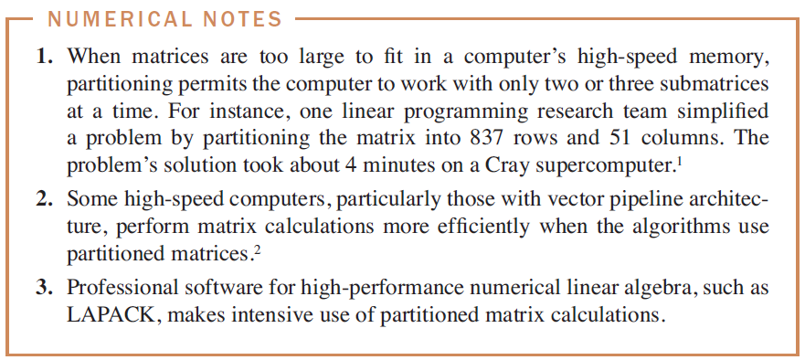

# Linear Algebra Project
<div style="text-align: right">Jeongyong Yang 양정용 (2018016035)</div>
<div style="text-align: right">Byungyu Lee 이병유 (2018016099)</div>
<div style="text-align: right">Hyunwook Chu 추현욱 (2018016244)</div>

___

## Problem
>How effective is **partitioned matrix** in computational efficiency?

우리는 partitioned(block) matrix를 행렬곱에 사용하면 굉장히 효율적이라고 배웠다. 이번 프로젝트의 목적은 partitioned matrix를 사용하면 의미있는 정도로 연산의 효율성이 증가하는지 확인해보는 것이다. 현대의 선형대수적 문제는 대부분 컴퓨터로 해결하고 있다. 우리는 매우 큰 matrix의 행렬곱을 사용하는 실제 문제를 찾아볼 것이다. 그 문제를 단순 행렬곱과 partitioned matrix로 분할 후 행렬곱을 통해 해결해본 후 비교하여 컴퓨터에서 연산의 이점이 있는지 알아볼 것이다.

컴퓨터가 신호를 처리하는 과정을 볼 것이다. 일반적으로 신호는 Fourier Transform을 통해 Time domain의 신호를 Frequency domain의 신호로 변환할 수 있게 된다. 이 때, 컴퓨터는 연속적인 신호를 처리할 수 없으므로 DFT(Discrete Fourier Transform)을 통해 신호를 Time domain에서 Frequency domain으로, Frequency domain에서 Time domain으로 변환하게 된다.

예를 들어서, 우리는 시작점과 끝점이 일치하는 연속된 선으로 이루어진 이미지를 컴퓨터로 처리하고 싶다고 생각해보자. 이미지를 신호로써 처리하기 위해 그림을 이루는 선의 여러 점을 sampling하여 time domain 상의 discrete한 signal을 얻을 수 있다. 이 때, 예를 들어 이 이미지를 time domain에서가 아니라, frequency domain에서 처리하고 싶다고 해보자. 따라서 우리는 결국 time domain signal을 DFT를 통해 frequency domain으로 옮겨주어야만 한다.

이 때, 우리는 DFT를 어떻게 하면 빠르게 할 지 탐색하고, 얼만큼 컴퓨터 연산에 효율성을 제공하는지 알아볼 것이다.


## Program we used
We used MATLAB.

## Applied Linear Algebra Concept
blah blah


## How to solve
매트랩 사용해서~~ 코드 첨부하고 ~~~ 등등...
```
hello(nice);
```

## Reference
1. hello
2. hi
3. bye